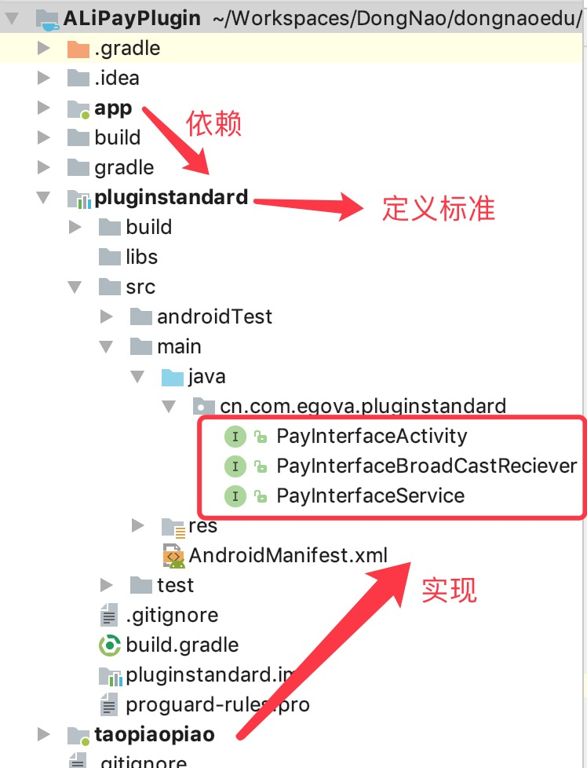
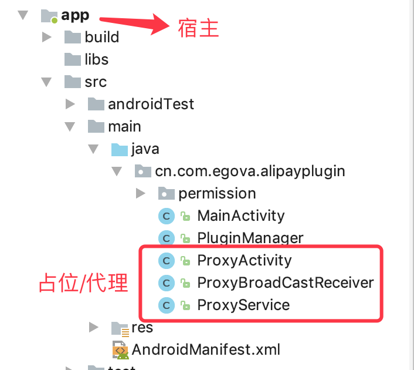
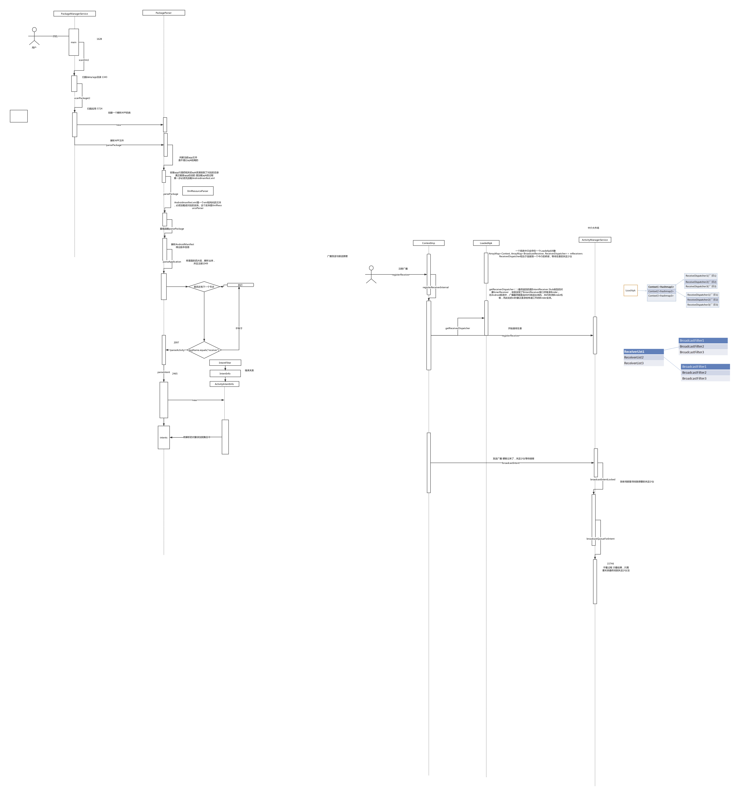

# 插桩式插件机制的原理
+ 概念：插桩式插件机制是指手机上只安装宿主程序，并不安装插件apk，但可以通过一系列手段加载插件中的内容，给人一种已安装插件apk的感觉。

+ 首先宿主程序要与插件通信，所以就需要定义一套统一的接口。四大组件都必须要定义。整个插件体系架构中会定义一套公共的标准，所有插件必须都实现这套统一的标准，而宿主也会依赖这个标准，但是宿主不用去具体实现，它只是使用这些接口与插件对接。所谓标准，也即一些公共的接口，包括各大组件的生命周期，以及至关重要的attach()方法等。 
  

+ 由于插件没有安装，因此它只有内容和资源，但是没有上下文(上下文这里我理解为运行环境)，所以只能通过宿主传递过去，更通俗的理解就是**宿主负责提供上下文和框架(生命周期)，插件负责提供内容和资源。**  具体来说，宿主会提供一套占位(或者说代理)的组件，如ProxyActivity，ProxyService，ProxyBroadCastReceiver等，它专门用来加载插件的内容和资源。表面上看我们启动了插件的界面、服务，但是本质上我们启动的还是宿主程序，因为只有它才有运行的环境。
    

+ 同样，由于插件根本不会安装进来，所以插件的四大组件除静态注册广播的BroadCastReceiver外，全都不用在清单文件中注册。但是，宿主程序中的占位组件，必须按照正常流程进行注册。


# 加载本地apk的dex文件和资源文件
+ apk文件主要由dex文件和资源文件(布局资源、图片资源等)组成，dex文件加载需要用到类加载器，资源文件的加载需要使用Resources工具类。apk安装与不安装，所需要的ClassLoader和Resources是完全不同的，Activity默认提供的getClassLoader()， getResources()就是用于加载本应用的，若要加载外部文件需另寻他法。

+ 由插桩式插件机制的原理我们知道宿主会加载插件apk的内容和资源，而加载这些东西需要使用DexClassLoader和Resources，所以占位Activity中必须重写 getClassLoader()， getResources() 这两个重要的方法！本项目中统一交给PluginManager进行管理，负责为ProxyActivity提供ClassLoader和Resources，这和换肤框架中的做法是一致的。

```
    public void loadPath(Context context, String pluginName) {
        this.context = context;
        //packageInfo
        File filesDir = context.getDir("plugin", Context.MODE_PRIVATE);
        String filePath = new File(filesDir, pluginName).getAbsolutePath();
        PackageManager packageManager = context.getPackageManager();
        packageInfo = packageManager.getPackageArchiveInfo(filePath, PackageManager.GET_ACTIVITIES);

        //dexClassLoader
        File dexOutFile = context.getDir("dex", Context.MODE_PRIVATE);
        //参数1:apk的路径， 参数2：dex文件缓存路径， 参数3：lib路径，null表示相对本项目，参数4：本项目的classLoader
        dexClassLoader = new DexClassLoader(filePath, dexOutFile.getAbsolutePath(), null, context.getClassLoader());

        //resources
        try {
            //加载插件apk中的资源，通过AssetManager的@hide注解掉的addAssetPath方法，方法的参数是apk的路径
            AssetManager assetManager = AssetManager.class.newInstance();
            Method addAssetPath = AssetManager.class.getMethod("addAssetPath", String.class);
            addAssetPath.invoke(assetManager, filePath);
            //参数1：assetManager，参数2：当前运行环境下的显示状态，参数3：当前运行环境下的配置
            resources = new Resources(assetManager, context.getResources().getDisplayMetrics(), context.getResources().getConfiguration());
        } catch (Exception e) {
            e.printStackTrace();
        }
    }
```


# PackageManagerService工作原理及静态广播的注册
+ PackageManagerService中提供了一个main()方法，这是应用程序的入口，这个main方法是被SystemService所调用。我们一这个方法为入口，浏览源码就可以寻找apk加载的全过程。

+ 手机启动时，会扫描 data/app 目录，将所有已安装的app重新安装一遍，并且会扫描所有的AndroidManifest.xml文件，注册静态广播(换句话说静态广播的注册时在手机开机启动时)。宿主加载插件apk时，我们也可以模仿系统加载并解析插件的AndroidManifest.xml文件，在宿主中完成静态广播的注册。

+ PackageManagerService及广播接收者工作原理图
    


# 插桩式插件机制实现过程
+ 定义标准；
    模拟四大组件的生命周期，以及一些重要的方法。
+ 插件实现标准
    准备一套BaseActivity， BaseService等，实现我们定义的接口，然后插件中的所有组件都分别实现这些基类，方便管理和维护。值得注意的是，由于插件并没安装，因此在书写这些基类的时候，凡是涉及到使用上下文的api时，务必重写(如findViewById，startActivity之类），并且要牢记插件的上下文由宿主提供。
+ 需要特别注意当在插件中使用startActivity，registerReceiver之类的方法时，实际上调用的是ProxyActivity中的方法。这个过程有点绕，需要仔细看代码。这里以startActivity为例简单说明。
    
```
    //插件中：
    startActivity(new Intent(that, SecondActivity.class));
    ||
    ||
    ||
    //插件Activity的基类BaseActivity中：
    @Override
    public void startActivity(Intent intent) {
        //这里new的Intent仅仅是为了传递数据过去.
        Intent m = new Intent();
        m.putExtra("className", intent.getComponent().getClassName());
        //that代表ProxyActivity,是通外部传进来的.
        that.startActivity(m);
    }
    ||
    ||
    ||
    //ProxyActivity中：
     @Override
    public void startActivity(Intent intent) {
        //className为插件中声明的要跳转到的Activity的全类名
        String className = intent.getStringExtra("className");
        //重新定义一个Intent，并且添加上目标className，然后自己启动自己
        Intent i = new Intent(this, ProxyActivity.class);
        i.putExtra("className", className);
        super.startActivity(i);
    }
    ||
    ||
    ||
    //非常重要的是ProxyActivity的onCreate()方法中会通过反射获取目标Activity的实例，并且加载它。
    。。。。。。。。。。。。。。。。
    private String className;
    private PayInterfaceActivity payInterfaceActivity;

    @Override
    public void onCreate(Bundle savedInstanceState) {
        super.onCreate(savedInstanceState);
        //ProxyActivity自己启动自己的时候，会传递类名参数进来。
        className = getIntent().getStringExtra("className");

        //根据类名，通过反射拿到需要跳转到的Activity的实例。
        try {
            Class activityClass = getClassLoader().loadClass(className);
            Constructor constructor = activityClass.getConstructor(new Class[]{});
            Object instance = constructor.newInstance(new Object[]{});
            payInterfaceActivity = (PayInterfaceActivity) instance;

            //注入上下文及生命周期
            payInterfaceActivity.attach(this);
            Bundle bundle = new Bundle();  //可传递信息
            payInterfaceActivity.onCreate(bundle);
        } catch (Exception e) {
            e.printStackTrace();
        }
    }
    
    //而ProxyActivity中的其他生命周期方法，也都调用的是接口方法，这样就相当于宿主提供上下文和框架，插件提供内容。
    @Override
    protected void onStart() {
        super.onStart();
        payInterfaceActivity.onStart();
    }

    @Override
    protected void onPause() {
        super.onPause();
        payInterfaceActivity.onPause();
    }


    @Override
    protected void onDestroy() {
        super.onDestroy();
        payInterfaceActivity.onDestroy();
    }
```

+ 插件中的Service启动与Activity大同小异

```
    //插件启动服务
    startService(new Intent(that, OneService.class));
   
    //基类BaseService
    @Override
    public ComponentName startService(Intent service) {
        Intent m = new Intent();
        m.putExtra("serviceName", service.getComponent().getClassName());
        return that.startService(m);
    }
    
    //ProxyService中通过反射拿到要开启的Service的实例，并启动它。
    private String serviceName;
    private PayInterfaceService payInterfaceService;

    @Override
    public IBinder onBind(Intent intent) {
        init(intent);
        return null;
    }

    private void init(Intent intent) {
        serviceName = intent.getStringExtra("serviceName");
        //加载Service类的实例
        try {
            Class serviceClass = PluginManager.getInstance().getDexClassLoader().loadClass(serviceName);
            Constructor constructor = serviceClass.getConstructor(new Class[]{});
            Object instance = constructor.newInstance(new Object[]{});
            payInterfaceService = (PayInterfaceService) instance;

            //注入上下文
            payInterfaceService.attach(this);

            //bundle可传递数据
            Bundle bundle = new Bundle();
            bundle.putInt("form", 1);
            payInterfaceService.onCreate();
        } catch (Exception e) {
            e.printStackTrace();
        }
        
        
        //同样ProxyService也只是提供一个框架，生命周期方法中使用插件Service的实例.
        @Override
    public int onStartCommand(Intent intent, int flags, int startId) {
        if (payInterfaceService == null) {
            init(intent);
        }
        return payInterfaceService.onStartCommond(intent, flags, startId);
    }

    @Override
    public boolean onUnbind(Intent intent) {
        payInterfaceService.onUnbind(intent);
        return super.onUnbind(intent);
    }

    @Override
    public void onRebind(Intent intent) {
        payInterfaceService.onRebind(intent);
        super.onRebind(intent);
    }

    @Override
    public void onLowMemory() {
        payInterfaceService.onLowMemory();
        super.onLowMemory();
    }

    @Override
    public void onDestroy() {
        payInterfaceService.onDestryoy();
        super.onDestroy();
    }
```

+ 动态广播比较容易实现，只要借鉴Activity和Service即可，并且它更简单，没有那么多生命周期。

```
     //发送动态广播
    Intent intent = new Intent();
    intent.setAction(BROAD_CAST_ACTION);
    sendBroadcast(intent);
    
    //基类BaseActivity
    @Override
    public void sendBroadcast(Intent intent) {
        that.sendBroadcast(intent);
    }
    
    //ProxyActivity中重写registerReceiver方法.
    @Override
    public Intent registerReceiver(BroadcastReceiver receiver, IntentFilter filter) {
        IntentFilter newIntentFilter = new IntentFilter();
        for (int i = 0; i < filter.countActions(); i++) {
            newIntentFilter.addAction(filter.getAction(i));
        }
        return super.registerReceiver(new ProxyBroadCastReceiver(this, receiver.getClass().getName()), newIntentFilter);
    }
    
    //占位ProxyBroadCastReceiver，通过DexClassLoader拿到Class对象，通过反射得到实例对象。
    public class ProxyBroadCastReceiver extends BroadcastReceiver {
    private String className;
    private PayInterfaceBroadCastReciever payInterfaceBroadCastReciever;

    public ProxyBroadCastReceiver(Context context, String className) {
        this.className = className;
        try {
            Class receiverClass = PluginManager.getInstance().getDexClassLoader().loadClass(className);
            Constructor constructor = receiverClass.getConstructor(new Class[]{});
            Object instance = constructor.newInstance(new Object[]{});
            payInterfaceBroadCastReciever = (PayInterfaceBroadCastReciever) instance;

            payInterfaceBroadCastReciever.attch(context);
        } catch (Exception e) {
            e.printStackTrace();
        }
    }

    @Override
    public void onReceive(Context context, Intent intent) {
        payInterfaceBroadCastReciever.onReceive(context, intent);
    }
}
```

+ 比较麻烦的是静态广播的注册。通过上面，我们已经知道静态广播是系统级的广播，是开机启动时，系统扫描全部已安装的应用的时候，解析app的清单文件，当解析发现静态广播时注册上的。正是因为这个原因，所以有的程序注册了开机广播，只要一开机就能知道。本项目借鉴了系统解析AndroidManifest.xml文件的思路，模仿了一个解析注册过程(注意系统级广播注册到了系统某个类中，我们这里将插件apk的静态广播注册到了当前应用中。所以，插件静态广播中的context实际上是宿主中的。

```
    private void parseReceivers(Context context, String path) {
//        Package对象
//        PackageParser pp = new PackageParser();
//        PackageParser.Package  pkg = pp.parsePackage(scanFile, parseFlags);
        try {
            Class packageParserClass = Class.forName("android.content.pm.PackageParser");
            Method parsePackageMethod = packageParserClass.getDeclaredMethod("parsePackage", File.class, int.class);
            Object packageParser = packageParserClass.newInstance();
            Object packageObj = parsePackageMethod.invoke(packageParser, new File(path), PackageManager.GET_ACTIVITIES);

            Field receiverField = packageObj.getClass().getDeclaredField("receivers");
            //拿到receivers  广播集合    app存在多个广播   集合  List<Activity>  name  ————》 ActivityInfo   className
            List receivers = (List) receiverField.get(packageObj);

            //PackageParser$Component身上有intents，类型是ArrayList<II> intents，II extends IntentInfo,IntentInfo继承IntentFilter.
            Class<?> componentClass = Class.forName("android.content.pm.PackageParser$Component");
            Field intentsField = componentClass.getDeclaredField("intents");

            //public static final ActivityInfo generateActivityInfo(Activity a, int flags, PackageUserState state, int userId)

            // 调用generateActivityInfo 方法所需参数1： PackageParser.Activity
            Class<?> packageParser$ActivityClass = Class.forName("android.content.pm.PackageParser$Activity");

            //调用generateActivityInfo 方法所需参数3：PackageUserState
            Class<?> packageUserStateClass = Class.forName("android.content.pm.PackageUserState");
            Object defaltUserState = packageUserStateClass.newInstance();

            //调用generateActivityInfo 方法所需参数4：userId
            Class<?> userHandler = Class.forName("android.os.UserHandle");
            Method getCallingUserIdMethod = userHandler.getDeclaredMethod("getCallingUserId");
            int userId = (int) getCallingUserIdMethod.invoke(null);

            // public static final ActivityInfo generateActivityInfo(Activity a, int flags, PackageUserState state, int userId)
            Method generateReceiverInfo = packageParserClass.getDeclaredMethod("generateActivityInfo",
                    packageParser$ActivityClass, int.class, packageUserStateClass, int.class);

            for (Object activity : receivers) {
                ActivityInfo info = (ActivityInfo) generateReceiverInfo.invoke(packageParser, activity, 0, defaltUserState, userId);
                BroadcastReceiver broadcastReceiver = (BroadcastReceiver) dexClassLoader.loadClass(info.name).newInstance();

                //intents是PackageParser$Component的成员变量，public final static class Activity extends Component<ActivityIntentInfo>
                List<? extends IntentFilter> intents = (List<? extends IntentFilter>) intentsField.get(activity);
                for (IntentFilter intentFilter : intents) {
                    context.registerReceiver(broadcastReceiver, intentFilter);
                }
            }
            //generateActivityInfo
        } catch (Exception e) {
            e.printStackTrace();
        }
    }
    
    
    public class StaticReceiver extends BroadcastReceiver {
        public static final String ACTION_FROM_PLUGIN = "cn.com.egova.static.PLUGIN_ACTION";
    
        @Override
        public void onReceive(Context context, Intent intent) {
            //注意这里的上下文是宿主程序的MainActivity，因为静态广播是由宿主解析插件的清单文件并注册的。
            Toast.makeText(context, "我是插件   收到宿主的消息  静态注册的广播  收到宿主的消息----->", Toast.LENGTH_SHORT).show();
            //向宿主发送广播
            context.sendBroadcast(new Intent(ACTION_FROM_PLUGIN));
            try {
                Thread.sleep(3000);
            } catch (InterruptedException e) {
                e.printStackTrace();
            }
            Toast.makeText(context, "休眠之后---->", Toast.LENGTH_SHORT).show();
    }
}
```