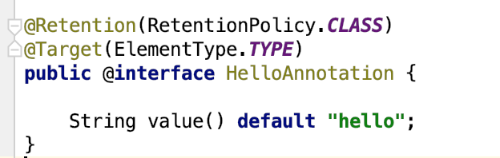
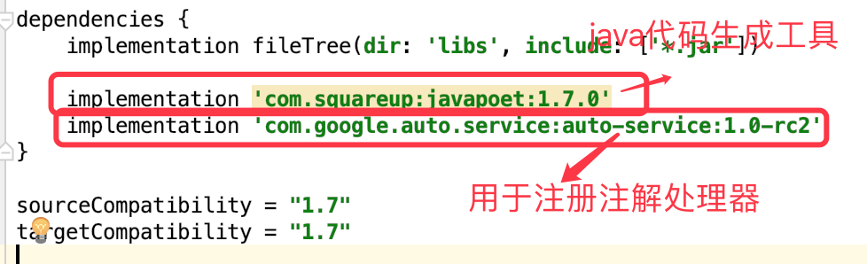
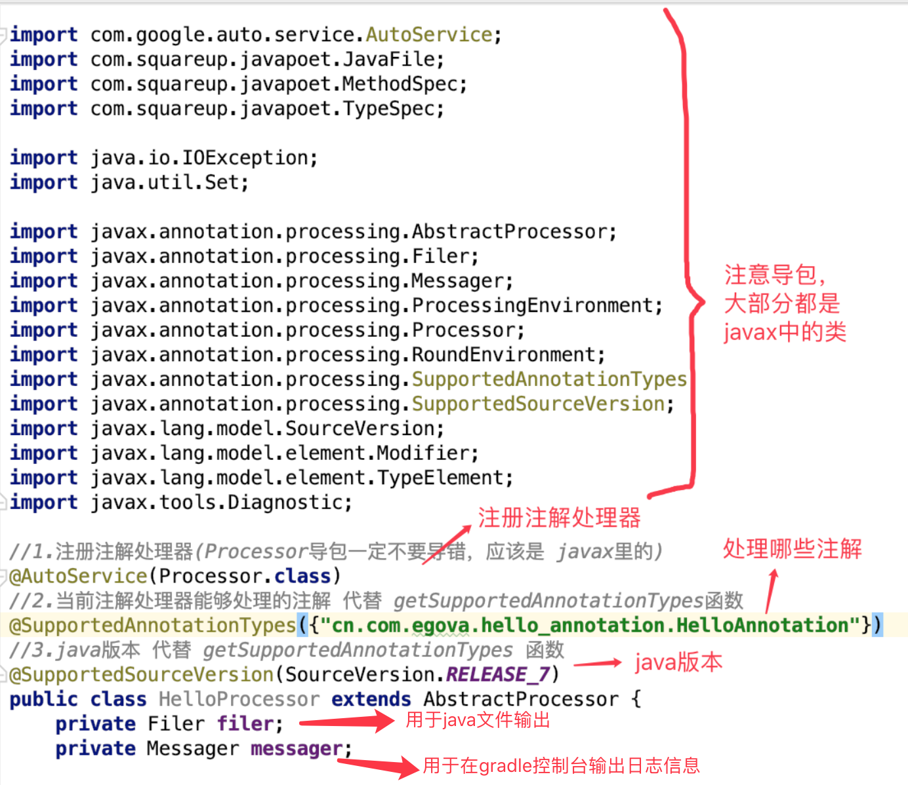
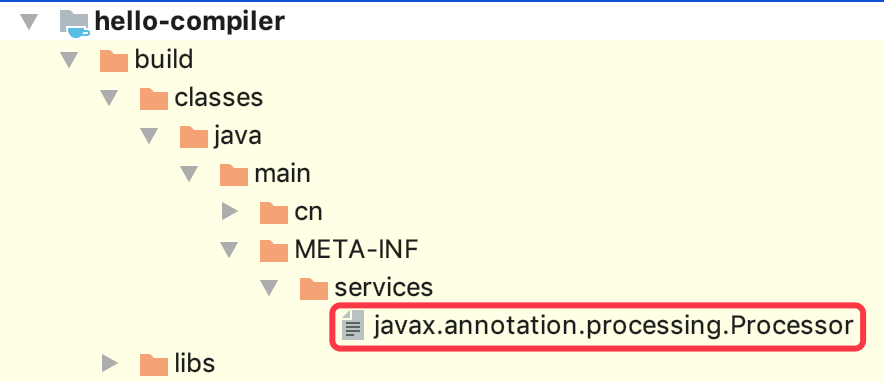
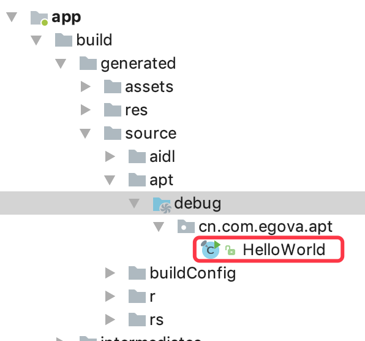
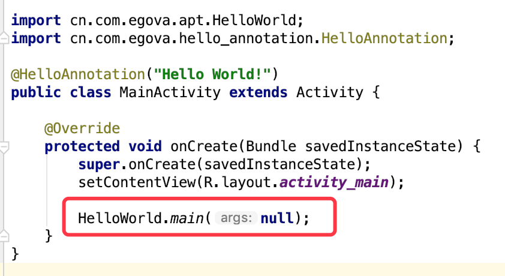

### Apt简单使用步骤及注意事项
+ app 为Android工程，hello-annotation、hello-compiler 均为java工程，app依赖hello-annotation、hello-compiler

+ hello-annotation 为所有自定义注解的集合，以HelloAnnotation为例，作用时机为编译期，作用对象是类文件； 
  

+ hello-compiler为注解处理器的集合地，它需要依赖2个工具: 
  

+ 编写注解处理器类HelloProcessor。
  

+ 编译后hello-compiler的build/classes/java/main/META-INF/services下应该能生成一个文件 
  

+ 正常情况下，在app工程的build/generated/source/apt/debug目录下，会按照注解处理器指定的包名和名字输出Java文件 
  

+ 动态生成 HelloWorld.java 文件后，就可以在其他地方引用它 
  

### 参考资料
1. [JavaPoet - 优雅地生成代码](https://blog.csdn.net/xuguobiao/article/details/72775730)
2. [github square/javapoet](https://github.com/square/javapoet)