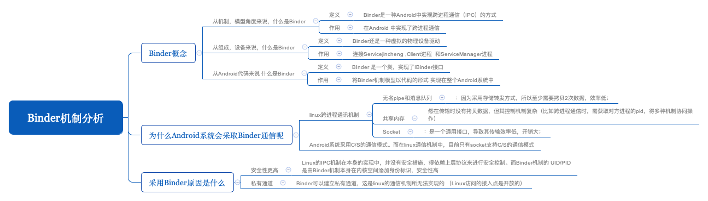
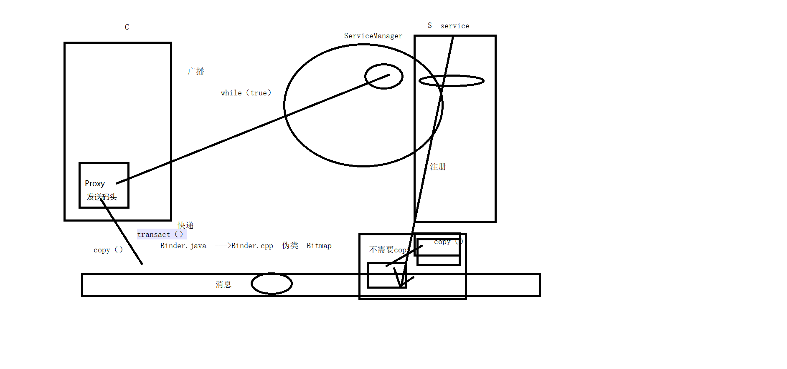
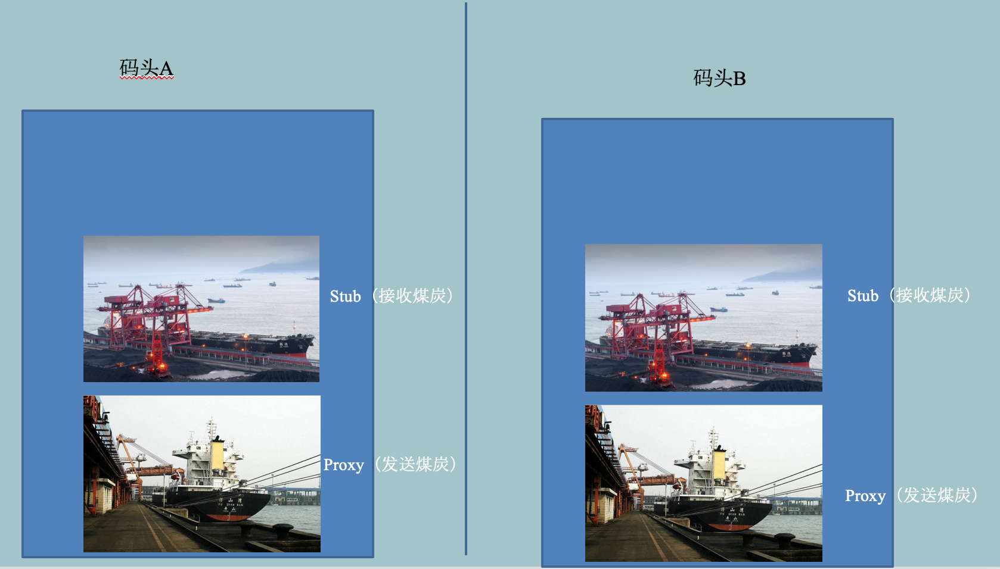
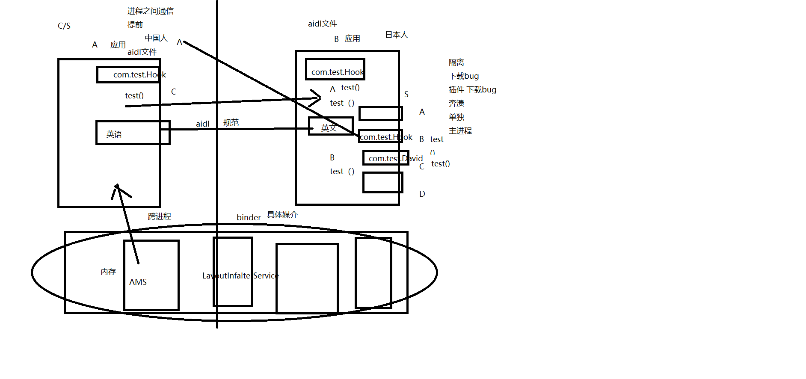
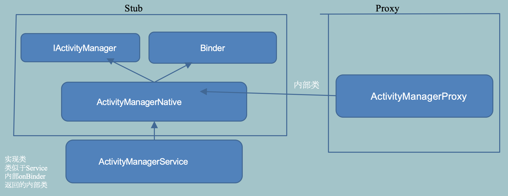
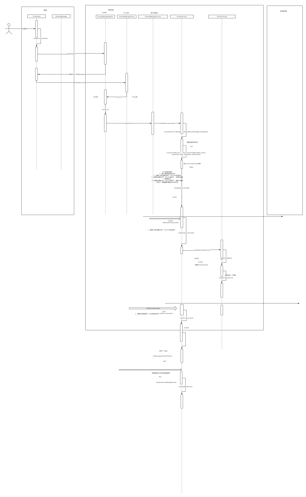

# Binder核心机制分析
   
# Binder概念
1. 从机制上来说，Binder是一种Android中实现跨进程通信（IPC）的方式。

2. 从组成设备来说，Binder还是一种虚拟的物理设备驱动  /dev/binder。

3. 从Android代码来说，Binder 是一个类，实现了IBinder接口，将Binder机制模型以代码的形式实现在整个Android系统中。 

# 为什么Android系统会采取Binder通信呢
+ Android 系统与众多app之间是一种 C/S 结构，Android是基于linux的，而linux本身就有一些跨进程通信的手段。那么为什么Android不直接拿来用呢？
  + socket     ：是一个通用接口，导致其传输效率低，开销大； 文件和端口  pass
  + 管道： A进程将数据发送到管道需要拷贝一次，管道将数据发送到B进程又需要拷贝一次，一次传输需要拷贝两次，损耗性能。       
  + 共享内存：效率非常高，A、B进程可以直接操作对方的内存，也就意味着可以互相修改对方的数据，但是管理起来非常复杂。

+ Binder：是谷歌工程师自己添加进来的，是对管道通信机制的提升，可以看成是私有管道。服务端进程与Binder(系统进程)有一部分内存是共享的，或者说是存在映射关系，两者相互传递数据不用拷贝，也就是说与linux原生的管道通信相比，Binder只需要拷贝一次，即客户端进程向Binder进程发送数据时。

+ 安全型：Linux的IPC机制在本身的实现中，并没有安全措施，得依赖上层协议来进行安全控制。	而Binder机制的UID/PID是由Binder机制本身在内核空间添加身份标识，安全性高。

+ 私有管道：Binder可以建立私有通道，这是linux的通信机制所无法实现的 （Linux访问的接入点是开放的）
+ Binder机制分析及内存映射图解
  
  

# Binder机制涉及到的3个对象1个接口
+ 发送方：Proxy --->实现接口即可(它并不需要从进程取消息)------> private static class Proxy implements cn.com.egova.binderframework.inter.IStudentManager；

+ 接收方：Stub--->继承Binder并实现接口--->public static abstract class Stub extends android.os.Binder implements cn.com.egova.binderframework.inter.IStudentManager 。一旦继承了Binder，就具备了取进程消息的能力。

+ 接口：定义具体功能，public interface IStudentManager extends android.os.IInterface。
  
```
    public cn.com.egova.binderframework.bean.Student getStudentById(java.lang.String id) throws android.os.RemoteException;

    public java.util.List<cn.com.egova.binderframework.bean.Student> getAllStudents() throws android.os.RemoteException;
```

+ 具体实现类：继承Stub，public class StudentManagerImp extends IStudentManager.Stub ，因为Stub继承了Binder并实现了接口，故具体实现类也继承Binder并实现接口。

> 在客户端进程中获取到的是Proxy对象，调用Proxy对象的方法时，Proxy对象会调用自身的 transact 方法，Stub对象则会回调 onTransact 方法，它们之间是通过一个方法标志号来识别的，以getStudentById为例，方法标志号为TRANSACTION_getStudentById。而在Stub的onTransact方法内部，最终调用的还是具体实现类的getStudentById方法(具体实现类继承Stub，Stub只是一个抽象类）。

+ 关于Binder进程间通信发送方与接收方的图解。
    	 
    
# bindService过程分析
+ 3个对象+1个接口
  + 发送方：ActivityManagerProxy
  + 接收方：ActivityManagerNative
  + 接口：IActivityManager
  + 具体实现类：ActivityManagerService   注意：ActivityManagerService本质并不是一个服务。
+ 	bindService过程图解
  
  

在Activity里调用bindService()，实际上走的是 ContextImp的bindService()，接着走 bindServiceCommon(), 内部调用ActivityManagerNative.getDefault().bindService()， ActivityManagerNative.getDefault() 返回一个IActivityManager的代理对象 ActivityManagerProxy 的实例，接着调用 ActivityManagerProxy的transact()，紧着着调用ActivityManagerNative的onTransact()， 在 onTransact() 最终调用的 IActivityManager 具体实现类 ActivityManagerService 的 bindService() 方法！


```
    ActivityManagerProxy内部的transact():
    public int bindService(IApplicationThread caller, IBinder token,
            Intent service, String resolvedType, IServiceConnection connection,
            int flags,  String callingPackage, int userId) throws RemoteException {
        Parcel data = Parcel.obtain();
        Parcel reply = Parcel.obtain();
        data.writeInterfaceToken(IActivityManager.descriptor);
        data.writeStrongBinder(caller != null ? caller.asBinder() : null);
        data.writeStrongBinder(token);
        service.writeToParcel(data, 0);
        data.writeString(resolvedType);
        data.writeStrongBinder(connection.asBinder());
        data.writeInt(flags);
        data.writeString(callingPackage);
        data.writeInt(userId);
        //ActivityManagerProxy的transact方法，发送数据
        mRemote.transact(BIND_SERVICE_TRANSACTION, data, reply, 0);
        reply.readException();
        int res = reply.readInt();
        data.recycle();
        reply.recycle();
        return res;
    }
```


```
    ActivityManagerNative内部的onTransact某分支：
    case BIND_SERVICE_TRANSACTION: {
            data.enforceInterface(IActivityManager.descriptor);
            IBinder b = data.readStrongBinder();
            IApplicationThread app = ApplicationThreadNative.asInterface(b);
            IBinder token = data.readStrongBinder();
            Intent service = Intent.CREATOR.createFromParcel(data);
            String resolvedType = data.readString();
            b = data.readStrongBinder();
            int fl = data.readInt();
            String callingPackage = data.readString();
            int userId = data.readInt();
            IServiceConnection conn = IServiceConnection.Stub.asInterface(b);
            //调用子类ActivityManagerService的对应方法
            int res = bindService(app, token, service, resolvedType, conn, fl,
                    callingPackage, userId);
            reply.writeNoException();
            reply.writeInt(res);
            return true;
        }
```


# 更多资料
[aidl简单实例](http://note.youdao.com/noteshare?id=403827f2ecb62cf07d70a98e8c6e3a03)
[动脑学院Binder驱动系列](https://www.jianshu.com/u/ebe7f901e1bc)