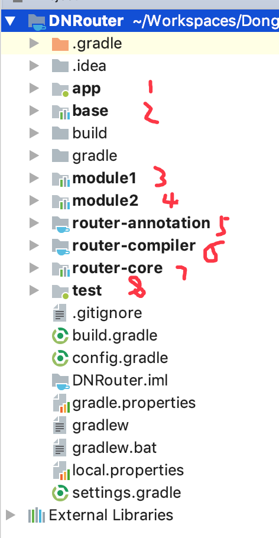
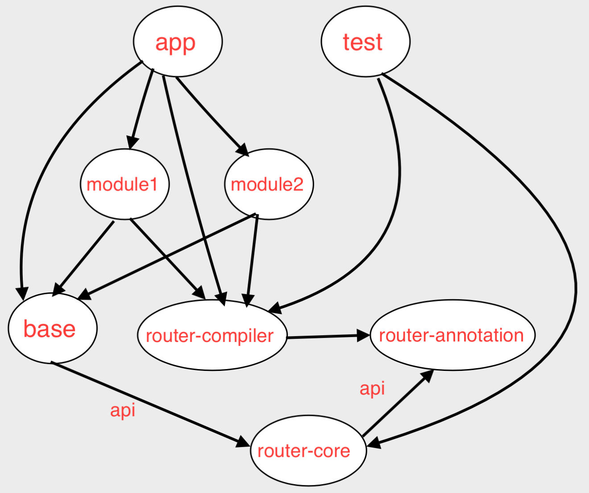
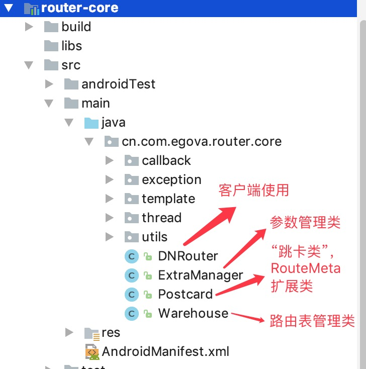

# Android组件化-路由框架
## 作用
快速简单的实现组件间的通讯

1. 前提：只在集成模式下才能发挥作用(因为集成模式下，所有类最终会打包到一个apk里边)，组件模式下是不可以的。
2. 在组件之间相互没有依赖的情况下，组件间通信的常用方法有如下几种：
   + 隐式激活：受限太强
   + aidl：使用起来太麻烦，学习成本高
   + 广播：较重量，使用较麻烦
   + EventBus：维护麻烦，功能有限
3. 而使用路由框架，则实现组件间通讯变得非常简单，其代码片段展示如下：
	    
	    //Activity跳转 一行代码
	    DNRouter.getInstance().build("/module1/test").withString("msg", "从MainActivity").navigation();
	    
	    //接口方法调用 两行代码
	    TestService testService = (TestService) DNRouter.getInstance().build("/main/service1").navigation();	  
        testService.test();
        
        //Activity跳转可以携带参数，支持多种数据类型的参数
        DNRouter.getInstance().build("/main/test")
                .withString("a", "从MainActivity")
                .withInt("b", 1)
                .withShort("c", (short) 2)
                .withLong("d", 3)
                .withFloat("e", 1.0f)
                .withDouble("f", 1.1)
                .withByte("g", (byte) 1)
                .withBoolean("h", true)
                .withChar("i", '好')
                .withParcelable("j", testParcelable)
                .withStringArray("aa", new String[]{"1", "2"})
                .withIntArray("bb", new int[]{1, 2})
                .withShortArray("cc", new short[]{(short) 2, (short) 2})
                .withLongArray("dd", new long[]{1, 2})
                .withFloatArray("ee", new float[]{1.0f, 1.0f})
                .withDoubleArray("ff", new double[]{1.1, 1.1})
                .withByteArray("gg", new byte[]{(byte) 1, (byte) 1})
                .withBooleanArray("hh", new boolean[]{true, true})
                .withCharArray("ii", new char[]{'好', '好'})
                .withParcelableArray("jj", new TestParcelable[]{testParcelable, testParcelable2})
                .withParcelableArrayList("k1", ps)
                .withParcelableArrayList("k2", ps)
                .withStringArrayList("k3", strings)
                .withIntegerArrayList("k4", integers)
                .withInt("hhhhhh", 1)
                .navigation(this, 100);
        
这一切都得益于我们将所有带有特定注解的Activity、IService实现类等都维护起来了，我们在内存中维护2张表，一张是路由分组表，一张是路由信息表，当我们需要跳转界面或者调用另一个组件对外暴露的接口方法时，只需要从内存中取出目的类的class对象，然后就可以实现跳转或调用其方法。	    
## 项目结构
本项目的结构如下图所示：

+ app、module1、module2：具体使用路由功能的模块，核心业务模块，其中app是主程序。
+ base：提供公共接口的模块，主要是指对外暴露的接口，即暴露给其他组件使用的接口。
+ router-annotation：自定义注解模块，所有路由相关的注解均定义在里边。
+ router-compiler：注解处理器模块，对应自定义路由注解，用于apt生成相关类。
+ router-core：路由框架核心模块，其中DNRouter、PostCard、ExtraManager等为核心中的核心类，它里边包含了如何完成2张表的数据填充、如何根据路径进行页面跳转、如何实现接口交互、如何传参、如何依赖注入等等等等一切底层逻辑。
+ test：仅仅用于测试apt功能而已。

## 项目建依赖关系

注意这里边有一个小知识点，即gradle依赖传递的问题。对于3.0以上版本，api 和 implementation 关键字的含义要搞清楚，一个会传递依赖，一个不会传递依赖。详情参考[Gradle的api与implementation关键字的区别](http://note.youdao.com/noteshare?id=3aa6fdff2aad72a7bda7a9ab747e8701)。

## 利用Apt生成路由相关类
+ 本项目的设计思路是每个module都包含两张表，一张是路由分组表(DNRouter$$Root$$moduleName)，其key为分组名，value为DNRouter$$Group$$groupName.class，一张是路由信息表(DNRouter$$Group$$groupName)，其key为路径，value为路由对象RouteMeta(封装有路径、目的地、类型等等)。路由分组表和路由信息表这2张表，是路由框架的核心中的核心。其中路由分组表的作用一是节省内存(内存中只保存当前所在组的路由信息)，而是便于维护。

+ 之所以要使用apt帮助我们自动生成这些路由相关类，是因为一个大型的项目中包括多个module, 一个module中有包含多个Activity或IService接口的实现类(用于对外暴露接口)，如果不使用apt，我们势必要手动创建很多这样的相似的类(DNRouter$$Root$$moduleName、DNRouter$$Group$$groupName)，并且没新建一个module或新建一个Activity或新建一个IService实现类，都要去做这个事情，实在是太麻烦，而用apt在编译时自动生成这些类则帮我们省去了很多时间成本和维护成本。

+ 实际开发中，应先创建出一套这样的类，然后对照着类去反过来书写apt的内容，这是因为apt输出较复杂的类比较麻烦，极易出错，并且调试起来比较麻烦(关于[apt的调试参考此处](http://note.youdao.com/noteshare?id=ab0a83a55a0f76eb5d537b31a9e574c0))。另外，apt部分使用了[javapoet框架，其相关文档参考此处](https://github.com/square/javapoet)

+ apt辅助生成类的过程中，注解处理器使用到了SupportedOptions注解，表示注解处理器要接收参数，本例的参数就是各模块的moduleName，目的是为了防止多模块/组件化开发的时候生成相同的 xx$$ROOT$$文件，因为同一项目中moduleName肯定是独一无二的，不会出现重复。但是，使用SupportedOptions注解，则module的build.gradle文件中则必须配置javaCompileOptions，否则会编译报错。

		android {
		    compileSdkVersion cfg.compileSdkVersion
		    defaultConfig {
		        minSdkVersion cfg.minSdkVersion
		        targetSdkVersion cfg.targetSdkVersion
		        versionCode cfg.versionCode
		        versionName cfg.versionName
		
		
		
		        testInstrumentationRunner "android.support.test.runner.AndroidJUnitRunner"
		
		        // 如果缺少下面这个配置，则会报如下错误：
		        // Error:Execution failed for task ':test:compileDebugJavaWithJavac'.
		        // > java.lang.RuntimeException: Not set Processor Parmaters.
		        javaCompileOptions {
		            annotationProcessorOptions {
		                arguments = [ moduleName : project.getName() ]
		            }
		        }
		    }
		
		    buildTypes {
		        release {
		            minifyEnabled false
		            proguardFiles getDefaultProguardFile('proguard-android.txt'), 'proguard-rules.pro'
		        }
		    }
		
		}

## 路由框架核心代码

+ 客户端使用时，只需要面向DNRouter类即可。它主要包括2个api,一个是 init()，一个是inject()。我们一般在Activity的onCreate方法中进行init(初始化)或inject(依赖注入)。

+ 页面路由、接口交互、传参、依赖注入的具体代码实现，请阅读具体代码，建议从DNRouter的init方法作入手。
  
  
  
  
  
# 参考资料：
+ [api与implementation的区别](http://note.youdao.com/noteshare?id=3aa6fdff2aad72a7bda7a9ab747e8701)
+ [apt调试方法](http://note.youdao.com/noteshare?id=ab0a83a55a0f76eb5d537b31a9e574c0)
+ [Androdid组件化实战(比本项目更加偏向业务场景)](https://github.com/wustor/AndroidComponent)
+ [电商APP组件化探索(精华必读)](https://juejin.im/post/5a6482f86fb9a01ca7138cbd)
+ [阿里巴巴路由框架Arouter(更完善,实际开发使用它即可)](https://github.com/alibaba/ARouter)