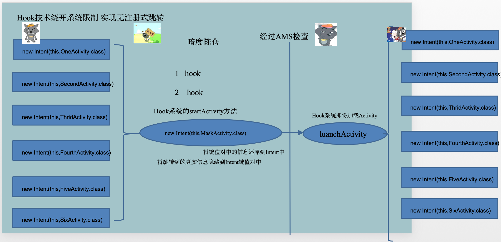
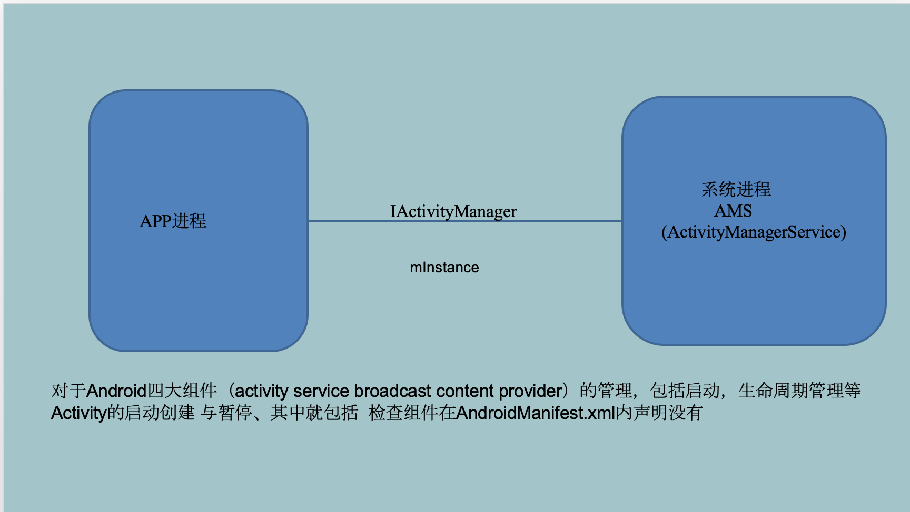
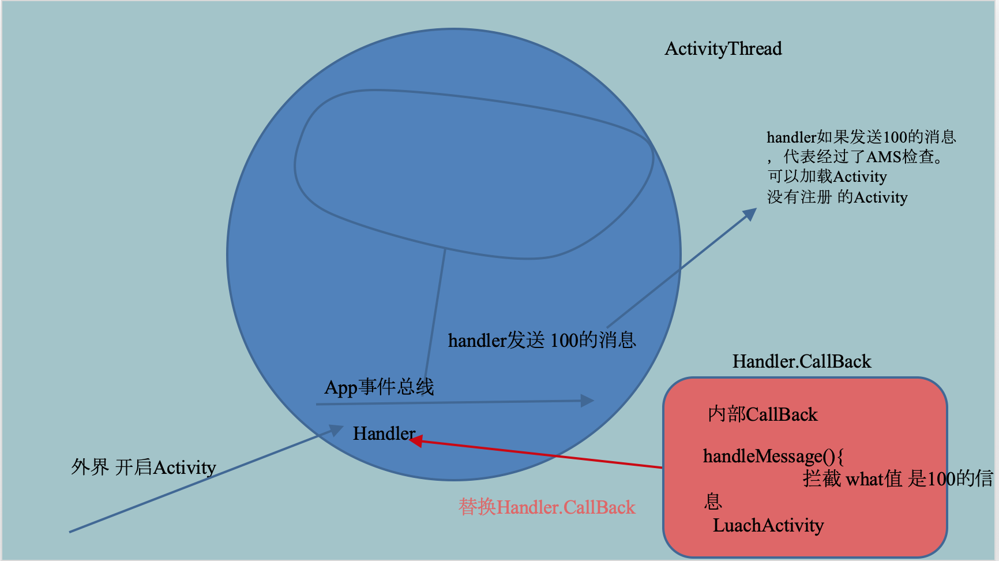
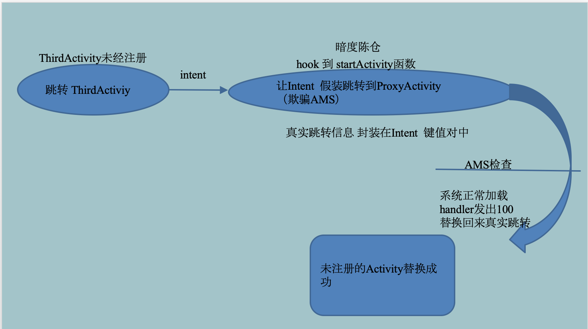

# Hook AMS服务实现大型登录架构

# 预期目标
+ 类似京东、苏宁易购等app，有的界面可以直接浏览，有的界面必须登录之后才可以浏览。如果没有登录，点击这些入口，系统会自动引导至登录界面，而登录成功之后，系统又会帮我们跳转到目标界面去。比如在京东上购物，选中某款商品后，点击“添加到购物车”，如果已登录，则直接跳转到购物车界面，如果还没有登录，则跳转到登录界面，用户登录成功之后，则自动跳转到购物车界面。
+ 一个大型的app可能有几十上百个界面，如果在每个界面都要进行登录逻辑的判断，代码不够简洁，应该采取集中式的管理方式，AOP的方式可以探索一下，当然本项目主要讨论的是Hook AMS(ActivityManagerService)服务的方式。

# 核心原理
通过拦截系统的执行过程，用我们的代理对象替换系统原来的对象，从而插入我们的业务，然后重新换回原系统对象，让程序继续往下执行。
> 从上面的描述可知，这项技术需要对系统源码有一定的了解。

# Hook技术的一般步骤
+ 第一步：确定Hook方法，如：startActivity()
+ 第一步：寻找Hook对象，以Hook方法为入口，阅读源码，寻找可以Hook的对象
+ 第二步：寻找Hook点，静态的Hook对象，或者可以得到Hook对象的静态成员变量。静态是为了保证内存的唯一性，即我们操作的和系统操作的是同一个实例，因为我们最终的目的替换Hook对象而不是创建一个新的实例。
+ 第四步：通过一系列反射得到Hook对象，然后通过动态代理或者静态代理的方式插入一些我们的业务。使用静态代理的方式相对简单，但前提是Hook对象有设置接口对象的api。如：setCallBack(), setOnXXXListener()之类，并且真正干活就是这些接口对象。

# 本项目Hook过程及源码追溯 
+ **hook startActivity方法**
> Activity.java
```
    @Override
    public void startActivity(Intent intent) {
        this.startActivity(intent, null);
    }
```
```
    @Override
    public void startActivity(Intent intent, @Nullable Bundle options) {
        if (options != null) {
            startActivityForResult(intent, -1, options);
        } else {
            // Note we want to go through this call for compatibility with
            // applications that may have overridden the method.
            startActivityForResult(intent, -1);
        }
    }
```
```
    /**
     * @hide
     */
    @Override
    public void startActivityForResult(
            String who, Intent intent, int requestCode, @Nullable Bundle options) {
        Uri referrer = onProvideReferrer();
        if (referrer != null) {
            intent.putExtra(Intent.EXTRA_REFERRER, referrer);
        }
        Instrumentation.ActivityResult ar =
            mInstrumentation.execStartActivity(
                this, mMainThread.getApplicationThread(), mToken, who,
                intent, requestCode, options);
        if (ar != null) {
            mMainThread.sendActivityResult(
                mToken, who, requestCode,
                ar.getResultCode(), ar.getResultData());
        }
        cancelInputsAndStartExitTransition(options);
    }   
```
> Instrumentation.java
```
     try {
            intent.migrateExtraStreamToClipData();
            intent.prepareToLeaveProcess(who);
            //ActivityManagerNative.getDefault()的返回值是IActivityManager，所以IActivityManager就是我们寻找的Hook对象,但它不是静态的，故继续寻找持有它的静态对象。
            int result = ActivityManagerNative.getDefault()
                .startActivity(whoThread, who.getBasePackageName(), intent, 
                intent.resolveTypeIfNeeded(who.getContentResolver()), token, target != null ? target.mEmbeddedID : null,requestCode, 0, null, options);
            checkStartActivityResult(result, intent);
        } catch (RemoteException e) {
            throw new RuntimeException("Failure from system", e);
        }
 ```
 
 > ActivityManagerNative.java
 ```       
    /**
     * Retrieve the system's default/global activity manager.
     */
    static public IActivityManager getDefault() {
        return gDefault.get();
    }
    //找到静态成员变量gDefault作为我们的Hook点
    private static final Singleton<IActivityManager> gDefault = new Singleton<IActivityManager>() {
        protected IActivityManager create() {
            IBinder b = ServiceManager.getService("activity");
            if (false) {
                Log.v("ActivityManager", "default service binder = " + b);
            }
            IActivityManager am = asInterface(b);
            if (false) {
                Log.v("ActivityManager", "default service = " + am);
            }
            return am;
        }
    };
```  

+ ActivityThread.H的实例(H继承了Handler)
    app的本质是一个无限循环的main函数，是以事件驱动进行运转。 
> ActivityThread的2个成员变量

    ```
    final Looper mLooper = Looper.myLooper();
    final H mH = new H();  //mH是我们要hook的对象，H是ActivityThread的非静态成员变量
    ```

    > ActivityThread.java -> main函数部分代码
    
        //但是我们发现ActivityThread内部持有了一个自己的静态实例sCurrentActivityThread，所以它就是我们的hook点。
        ActivityThread thread = new ActivityThread();
        thread.attach(false);
        ------------------------------
         private void attach(boolean system) {
                sCurrentActivityThread = this;
                mSystemThread = system;
                if (!system) {
                    ViewRootImpl.addFirstDrawHandler(new Runnable() {
                        @Override
                        public void run() {
                            ensureJitEnabled();
                        }
                    });
                                   
 ```   
    //下面是H类的部分代码，从中可以看到LAUNCH_ACTIVITY对应的消息标志号为100   
   private class H extends Handler {
        public static final int LAUNCH_ACTIVITY         = 100;
        public static final int PAUSE_ACTIVITY          = 101;
        public static final int PAUSE_ACTIVITY_FINISHING= 102;
        public static final int STOP_ACTIVITY_SHOW      = 103;
        public static final int STOP_ACTIVITY_HIDE      = 104;
        public static final int SHOW_WINDOW             = 105;
        public static final int HIDE_WINDOW             = 106;
        public static final int RESUME_ACTIVITY         = 107;
        public static final int SEND_RESULT             = 108;
  ..........................
  public void handleMessage(Message msg) {
            if (DEBUG_MESSAGES) Slog.v(TAG, ">>> handling: " + codeToString(msg.what));
            switch (msg.what) {
                case LAUNCH_ACTIVITY: {
                    Trace.traceBegin(Trace.TRACE_TAG_ACTIVITY_MANAGER, "activityStart");
                    final ActivityClientRecord r = (ActivityClientRecord) msg.obj;

                    r.packageInfo = getPackageInfoNoCheck(
                            r.activityInfo.applicationInfo, r.compatInfo);
                    handleLaunchActivity(r, null, "LAUNCH_ACTIVITY");
                    Trace.traceEnd(Trace.TRACE_TAG_ACTIVITY_MANAGER);
                } break;    
  .................................
 
 ```
 
 > Handler.java  对于Handler我们可以使用静态代理的方式，替换掉它原有的mCallback对象，因为它是收到消息后具体处理的类。  
 ```  
  public class Handler {
       private static final boolean FIND_POTENTIAL_LEAKS = false;
        private static final String TAG = "Handler";
    /**
     * Callback interface you can use when instantiating a Handler to avoid
     * having to implement your own subclass of Handler.
     *
     * @param msg A {@link android.os.Message Message} object
     * @return True if no further handling is desired
     */
    public interface Callback {
        public boolean handleMessage(Message msg);
    }
    /**
     * Subclasses must implement this to receive messages.
     */
    public void handleMessage(Message msg) {
    }     
    /**
     * Handle system messages here.
     */
    public void dispatchMessage(Message msg) {
        if (msg.callback != null) {
            handleCallback(msg);
        } else {
            if (mCallback != null) {
                if (mCallback.handleMessage(msg)) {
                    return;
                }
            }
            handleMessage(msg);
        }
    }                  
```

# 相关图解及关于Activity免注册的问题
注意：在整个过程中，ProxyActivity只是一个幌子，它是已经在AndroidManifest.xml注册过了的，我们拦截到真实的Intent后，假装跳转到ProxyActivity，欺骗AMS发出100消息，然后在Handler中处理一些业务逻辑，并且根据需要替换对应的Intent，这样其他的Activity就可以免注册！**免注册过程可以形容为：伪装--->通过检查---->撕去伪装。**









# Hook的时机
最后，我们还需要注意hook的时机，由于本项目是要拦截Activity的跳转，所以将hook的时机放在应用程序启动时，故创建了一个MyApplication，在它的onCreate方法中调用hook相关的方法。