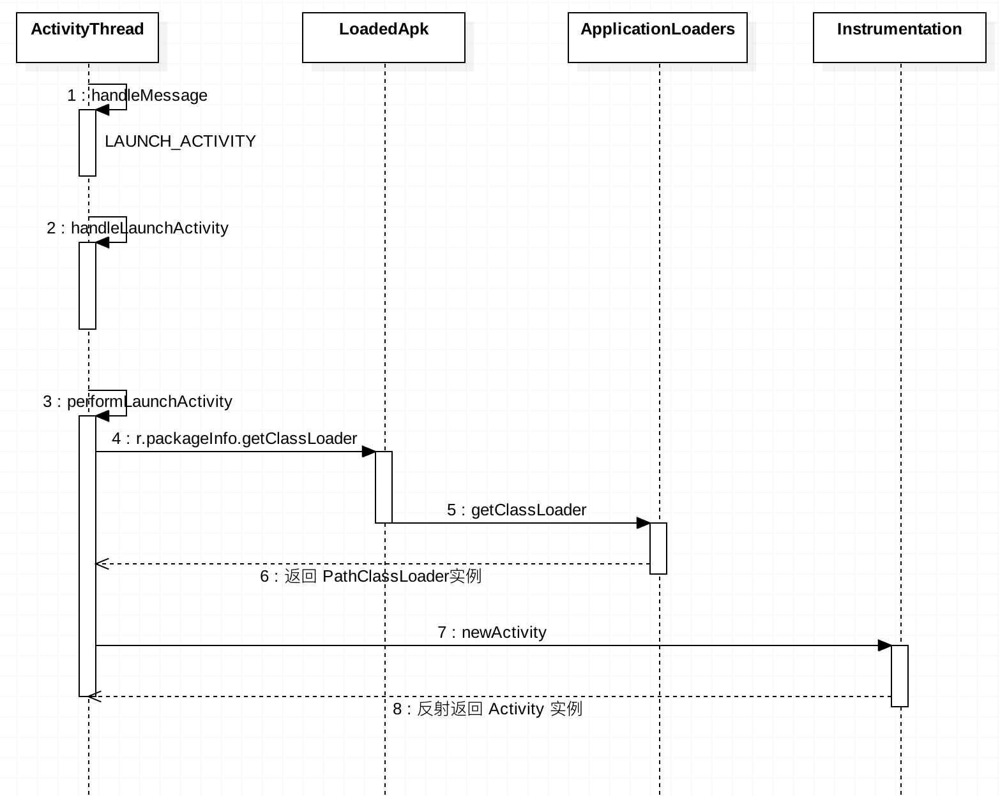

# Hook 实现加载完整的插件
# 前言
+ 上一个章节我们已经实现通过Hook技术，实现大型登录架构的统一处理，其中有一个很重要的点就是可以实现Activity的免注册！而对插件来说，Activity免注册是一个必要条件，因为插件apk没有安装，即使在其清单文件里注册也无作用。
+ 解决了Activity免注册后，接下来就是使用另一种思路来加载插件的内容和资源。之前已经学习过支付宝的插桩式插件机制(DL框架)，现在学习360的另一种DroidPlugin框架来实现插件加载。

# 核心原理
将插件的dex文件融入到宿主程序中来，使之成为“一家人”，同时仍然使用AssetManager和Resources来加载外部资源。
> 插件dex文件融合进来后并不会造成类名冲突，因为它们的包名不同，全类名肯定不同。此外，插件融入后只要宿主程序安装并运行，则插件也具备了运行环境，只不过不可以重写插件的Application类，因为这种机制下，插件的Application不再是原来的那个，已经变成宿主程序的Application了（在插件里使用 getApplication()得到的是宿主的Application）。

# 关于ClassLoader
+ 加载程序内部的class是通过 dalvik.system.PathClassLoader，所以在Activity或Application内部我们可以直接 `PathClassLoader classLoader = (PathClassLoader)context.getClassLoader()`,而加载外部apk的class是通过 dalvik.system.DexClassLoader，这两个ClassLoader有几个共同点：
    + 有共同的父类：dalvik.system.BaseDexClassLoader
    + 本类都没有特殊的方法，都只是简单的继承了一下父类的构造函数，并且什么事情也没做
    
+ BaseDexClassLoader中有一个非常重要的成员变量 DexPathList， BaseDexClassLoader 中的各种findXXX方法，本质上都是调用的 DexPathList 的findXXX方法。
    

+ DexPathList 中有一个非常重要的成员 dexElements `private final Element[] dexElements;`，**它代表的是每个dex文件在内存中的映射，找到它就找到了dex文件**。在BaseDexClassLoader的构造函数里会实例化DexPathList，而在DexPathList的构造函数里会实例化 dexElements，所以不需要我们手动的去获取，系统自动帮我们完成了，我们要做的就是通过反射拿到这个dexElements。
  
    ```
    // save dexPath for BaseDexClassLoader
    this.dexElements = makePathElements(splitDexPath(dexPath), optimizedDirectory,suppressedExceptions);
    ```
    
# 关于Activity启动过程续
之前在hook实现大型登陆架构了通过跟踪源码分析到，当ActivityThread.H 接收到 LAUNCH_ACTIVITY 消息标志后，会启动一个Activity，那么接下来的启动过程是如何进行的呢？
    

关键代码片段：    
 
```
case LAUNCH_ACTIVITY: {
    Trace.traceBegin(Trace.TRACE_TAG_ACTIVITY_MANAGER, "activityStart");
    final ActivityClientRecord r = (ActivityClientRecord) msg.obj;

    r.packageInfo = getPackageInfoNoCheck(
            r.activityInfo.applicationInfo, r.compatInfo);
    handleLaunchActivity(r, null);
    Trace.traceEnd(Trace.TRACE_TAG_ACTIVITY_MANAGER);
} break;
```   
    
```
// Initialize before creating the activity
WindowManagerGlobal.initialize();
Activity a = performLaunchActivity(r, customIntent);
```              
 
```
Activity activity = null;
try {
    java.lang.ClassLoader cl = r.packageInfo.getClassLoader();
    activity = mInstrumentation.newActivity(
            cl, component.getClassName(), r.intent);
    StrictMode.incrementExpectedActivityCount(activity.getClass());
    r.intent.setExtrasClassLoader(cl);
    r.intent.prepareToEnterProcess();
    if (r.state != null) {
        r.state.setClassLoader(cl);
    }
} catch (Exception e) {
    if (!mInstrumentation.onException(activity, e)) {
        throw new RuntimeException(
            "Unable to instantiate activity " + component
            + ": " + e.toString(), e);
    }
}
```     
   
   
```
//LoadedApk.java    getClassLoader()
 mClassLoader = ApplicationLoaders.getDefault().getClassLoader(zip, lib,mBaseClassLoader);
``` 


```
//ApplicationLoaders.java     getClassLoader()
Trace.traceBegin(Trace.TRACE_TAG_ACTIVITY_MANAGER, zip);
PathClassLoader pathClassloader =
    new PathClassLoader(zip, libPath, parent);
Trace.traceEnd(Trace.TRACE_TAG_ACTIVITY_MANAGER);

mLoaders.put(zip, pathClassloader);
return pathClassloader;
```
   
```
//Instrumentation.java  newActivity()
public Activity newActivity(ClassLoader cl, String className,
        Intent intent)
        throws InstantiationException, IllegalAccessException,
        ClassNotFoundException {
    return (Activity)cl.loadClass(className).newInstance();
}      
``` 
         
+ 从上面的启动过程可以看出，Activity中负责加载相关dex文件的是PathClassLoader，Activity的实例化是在启动过程中进行的，并不是应用程序一启动就开始。所以我们将要融合宿主与插件dex文件的步骤放在Application中进行，这样才能保证在启动插件Activity之前dex文件肯定已经融合过了。 

+ Hook 技术加载插件，**宿主程序的LaunchActivity必须是继承Activity， 而不能是AppCompatActivity， 否则会报错**：`java.lang.IllegalAccessError: Class ref in pre-verified class resolved to unexpected implementation  ` ，原因暂时不清楚。    

# 关于app的静态资源加载
AssetManager 是用来加载apk资源文件的核心类。它提供2个重要方法：
+ addAssetPath：将资源文件添加到应用中来；
+ ensureStringBlocks：实例化StringBlocks数组(apk中的静态资源文件最终都会存储到 StringBlock)，并对其进行赋值。

如果apk正常安装，上述两个方法不需要我们手动调用，系统会帮我们完成，但如果是插件，则需要我们手动调用一下。并且这两个方法都是系统@hide注解的方法，所有只能通过反射调用。

> apk   resource StringBlocks
> string.xml  --->StringBlock
> color.xml ----->StringBlock
> anim.xml ------>StringBlock
> ensureStringBlocks() ----> StringBlocks数组 ----> 当我们使用Resource.getDrawable()、getText() 等方法时，都是从StringBlocks中获取对应资源。

```
/**
 * 加载插件apk的资源
 */
private void initResources() {
    String apkPath = Environment.getExternalStorageDirectory().getAbsolutePath() + "/" + Const.PLUGIN_APK_NAME;
    try {
        assetManager = AssetManager.class.newInstance();
        Method addAssetPathMethod = assetManager.getClass().getDeclaredMethod("addAssetPath", String.class);
        addAssetPathMethod.setAccessible(true);
        addAssetPathMethod.invoke(assetManager, apkPath);

        //手动实例化插件的StringBlocks数组
        Method ensureStringBlocksMethod = assetManager.getClass().getDeclaredMethod("ensureStringBlocks");
        ensureStringBlocksMethod.setAccessible(true);
        ensureStringBlocksMethod.invoke(assetManager);

        //实例化resourecs
        Resources supResources = getResources();
        newResource = new Resources(assetManager, supResources.getDisplayMetrics(), supResources.getConfiguration());
    } catch (Exception e) {
        e.printStackTrace();
    }
}
```
        
  

