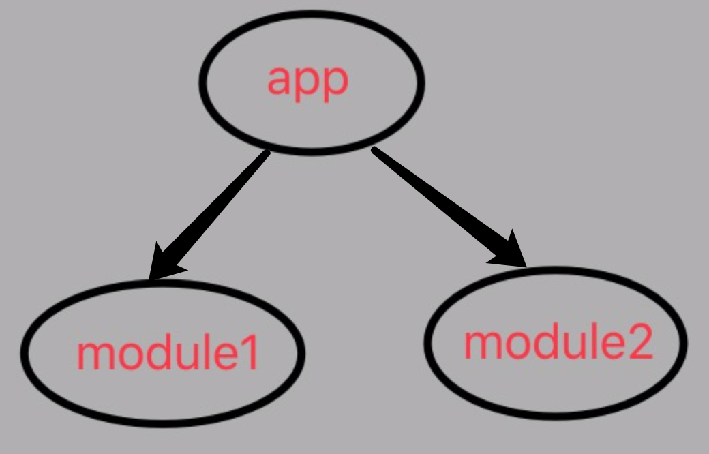
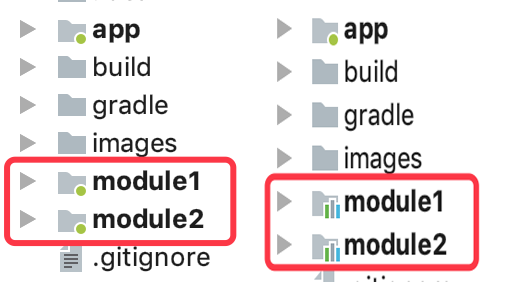
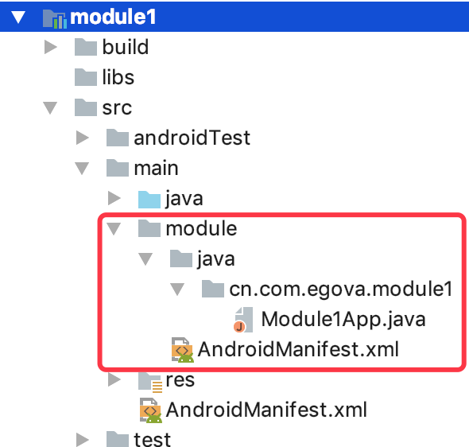

# Android组件化演化之路1
## 作用
方便维护和调试。根据具体业务划分模块，可以单独对某一模块进行开发和调试。

## 项目结构
本例是一个最简单的组件化流程。其项目结构如下：

app依赖module1和module2，module1和module2之间相互无依赖。

## Gradle配置
1. 创建一个config.gradle文件。在其中定义项目版本号、SDK版本，以及一些必要的变量。目的是统一整个项目的业务module，便于统一管理和维护。

		ext {
		    //false 组件模式 
		    //true 集成模式
		    isModule = false    //改标记后需要Rebuild一下，直接build会报错.另外同步一下gradle则项目标记(app,library)才会变.
	
		    android = [
		            compileSdkVersion: 26,
		            minSdkVersion    : 14,
		            targetSdkVersion : 26,
		            versionCode      : 1,
		            versionName      : "1.0"
		    ]
		
		    appId = [
		            "app"    : "cn.com.egova.myrouter",
		            "module1": "cn.com.egova.module1",
		            "module2": "cn.com.egova.module2"
		    ]
		
		    supportLibrary = "26.1.0"
		
		    dependencies = [
		            "appcompat-v7": "com.android.support:appcompat-v7:${supportLibrary}"
		    ]
		}

2. 这里涉及到两种所谓的模式，一是集成模式，即module1、module2作为library存在，全部集成到app中打包到一个apk中。二是组件模式，即module作为一个独立的app，可以单独安装测试。这两种模式下module1、module2的图标不一样，如图：

3. 项目的build.gradle文件依赖config.gradle
	
		apply from: "config.gradle"

		buildscript {
		    
		    repositories {
		        google()
		        jcenter()
		    }
		    dependencies {
		        classpath 'com.android.tools.build:gradle:3.0.1'
		    }
		}
	
		allprojects {
		    repositories {
		        google()
		        jcenter()
		    }
		
		    //解决suport库版本冲突问题.
		    configurations.all {
		        resolutionStrategy.force 'com.android.support:support-annotations:27.1.1'
		    }
		}
		
		task clean(type: Delete) {
		    delete rootProject.buildDir
		}

4. app、module1、module2等通过rootProject拿到config.gradle中定义的相关变量并使用。

		def cfg = rootProject.ext.android
		def appId = rootProject.ext.appId
		def depend = rootProject.ext.dependencies
       
        .............
	   	//使用这些变量 
		compileSdkVersion cfg.compileSdkVersion
	    defaultConfig {
	        applicationId appId["app"]
	        minSdkVersion cfg.minSdkVersion
	        targetSdkVersion cfg.targetSdkVersion
	        versionCode cfg.versionCode
	        versionName cfg.versionName
	        testInstrumentationRunner "android.support.test.runner.AndroidJUnitRunner"
    	}
    	
    	............
    	if (isModule) {
        implementation project(':module1')
        implementation project(':module2')
    	}
    	
5. 对于module1、module2的build.gradle中，还需注意apply、sourceSets等的配置

    	//切换模式后clean一下整个项目，否则可能会报错。
		if(isModule){
		    apply plugin: 'com.android.library'
		}else{
		    apply plugin: 'com.android.application'
		}
		
		def cfg = rootProject.ext.android
		def appId = rootProject.ext.appId
		def depend = rootProject.ext.dependencies
		
		
		android {
		    compileSdkVersion cfg.compileSdkVersion
		
		    defaultConfig {
		        minSdkVersion cfg.minSdkVersion
		        targetSdkVersion cfg.targetSdkVersion
		        versionCode cfg.versionCode
		        versionName cfg.versionName
		
		        testInstrumentationRunner "android.support.test.runner.AndroidJUnitRunner"
		
		        //组件模式下
		        if (!isModule) {
		            applicationId appId["module1"]
		        }
		
		        //资源配置
		        sourceSets{
		            main{
		                //在组件模式下使用不同的AndroidManifest.xml文件
		                if(!isModule){
		                    manifest.srcFile "src/main/module/AndroidManifest.xml"
		                    java.srcDirs 'src/main/module/java','src/main/java'
		                }else{
		                    manifest.srcFile 'src/main/AndroidManifest.xml'
		                }
		            }
		        }
		    }
		
		    buildTypes {
		        release {
		            minifyEnabled false
		            proguardFiles getDefaultProguardFile('proguard-android.txt'), 'proguard-rules.pro'
		        }
		    }
		
		}
		
		dependencies {
		    implementation fileTree(dir: 'libs', include: ['*.jar'])
		
		    implementation depend["appcompat-v7"]
		    implementation 'com.android.support.constraint:constraint-layout:1.1.0'
		    testImplementation 'junit:junit:4.12'
		    androidTestImplementation 'com.android.support.test:runner:1.0.2'
		    androidTestImplementation 'com.android.support.test.espresso:espresso-core:3.0.2'
		}

## 组件模式下新增源文件目录
由于组件模式下，module作为独立app运行，因此需要applicationId，启动Activity等。所以我们需要在main目录下，新建一个与java目录同级的module目录(或debug目录，因为主要用于调试，这个名字自己定义)，该目录下存放AndroidManifest.xml文件、ModuleApp或者ModuleActivity(启动Activity)等。

注： 
1.这个目录的路径其实并不唯一，但是必须与module的build.gradle中的sourceSets配置中的路径保持一致。 
2.模式切换的时候，必须先clean一下整个项目，然后稍微改动一下app或module的build.gradle(比如按个回车之类的)，触发gradle同步，同步完之后，模式才能真正切换成功，否则可能报错。

